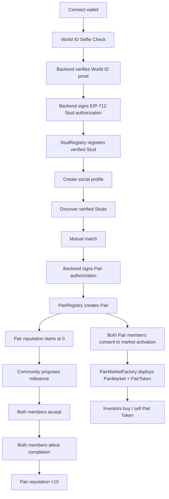
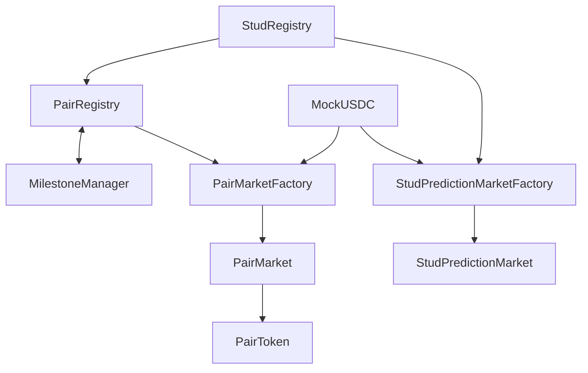

# Stud

> **Stud is a World ID-verified social + market protocol where real humans can discover each other, form a shared onchain Pair identity, build reputation through mutual consent, and unlock progressively larger markets.**

Stud was built as an ETHGlobal Online 2026 hackathon project. It combines a verified social experience with two market primitives:

- **Stud prediction markets** around objective protocol events for individual verified users.
- **Pair Token markets** for shared identities created when two verified users mutually match.

The core idea is simple:

```text
Verified Human A
+
Verified Human B
+
Mutual Match
=
New Onchain Pair Identity
```

A Pair is not just a database relationship. It becomes a persistent protocol object with its own Pair ID, reputation, milestone history, and optional token market.

> **Reputation changes permissions. Market demand changes price.**

---

## Live deployment

| Component | Deployment |
|---|---|
| Frontend | https://stud-dwwj.vercel.app |
| Backend API | https://stud-production-a5e2.up.railway.app |
| Network | World Chain Sepolia |
| Chain ID | `4801` |
| Explorer | https://sepolia.worldscan.org |
| Public RPC | `https://worldchain-sepolia.g.alchemy.com/public` |

> Stud is currently a testnet hackathon prototype. The contracts use test collateral and are not intended for production financial use.

---

## Deployed contracts - World Chain Sepolia

| Contract | Address |
|---|---|
| **StudRegistry** | [`0x67579f86904F7ABBd17cbD46ED2603063AEeb2CB`](https://sepolia.worldscan.org/address/0x67579f86904F7ABBd17cbD46ED2603063AEeb2CB) |
| **PairRegistry** | [`0xF217d76EbBc209063046357B70a87A52b2435d49`](https://sepolia.worldscan.org/address/0xF217d76EbBc209063046357B70a87A52b2435d49) |
| **MilestoneManager** | [`0x342192523A1b35B21c8B3F042fAC922643fE64d4`](https://sepolia.worldscan.org/address/0x342192523A1b35B21c8B3F042fAC922643fE64d4) |
| **MockUSDC** | [`0x08af45235BbC35860AC5D99ac6E5D0BEaf985A14`](https://sepolia.worldscan.org/address/0x08af45235BbC35860AC5D99ac6E5D0BEaf985A14) |
| **PairMarketFactory** | [`0x72Aa2aaB27895f7E54b99D3f5D8Da456BfBBEa8F`](https://sepolia.worldscan.org/address/0x72Aa2aaB27895f7E54b99D3f5D8Da456BfBBEa8F) |
| **StudPredictionMarketFactory** | [`0x8F3D1a9799729EB19e6E183FE87d6972d9d033D6`](https://sepolia.worldscan.org/address/0x8F3D1a9799729EB19e6E183FE87d6972d9d033D6) |

`PairToken` and `PairMarket` contracts are deployed per Pair when that Pair explicitly activates its financial market. `StudPredictionMarket` contracts are deployed per approved prediction market through the factory.

---

## Why Stud?

Social applications have a basic identity problem: creating another account is cheap. That makes bots, duplicate profiles, fake engagement, and reputation farming difficult to prevent.

At the same time, financialized social products often jump directly from social attention to speculation without giving the social object a meaningful history or consent model.

Stud takes a different approach:

```text
Unique human verification
        ↓
Social interaction
        ↓
Mutual match
        ↓
Shared Pair identity
        ↓
Consent-based milestones
        ↓
Pair reputation
        ↓
Larger market permissions
```

The protocol separates **social proof**, **reputation**, and **price discovery**.

A milestone can improve Pair reputation, but the protocol never directly increases the Pair Token price. Price only moves because market participants buy or sell.

---

# Core participants

## Stud

A **Stud** is a wallet registered as a unique verified human.

A Stud can:

- connect a wallet
- complete World ID Selfie Check
- register a verified Stud identity onchain
- create an offchain social profile
- discover other verified Studs
- like / match with another Stud
- become a member of a Pair
- accept Pair milestones
- attest milestone completion
- consent to activating a Pair Token market

World ID verification and the wallet-to-Stud relationship are enforced onchain through `StudRegistry`.

## Pair

A **Pair** is created when two verified Studs mutually match.

The Pair starts with:

```text
Pair ID
Reputation = 0
Active = true
No financial market by default
```

This distinction is important:

> **A social Pair can exist without a financial market.**

Creating a Pair after a mutual match does not automatically tokenize the relationship. The Pair Token market is activated separately and requires explicit consent from both Pair members.

## Investor / community participant

An investor or community participant can:

- browse verified Studs
- browse Pairs
- participate in approved YES/NO prediction markets
- buy and sell Pair Tokens after a Pair activates its market
- propose Pair milestones
- observe Pair reputation and market state

Investors cannot force a milestone, create a Pair, or activate a Pair market on behalf of the members.

---

# End-to-end protocol flow



---

# World ID and Stud registration

Stud uses World ID as the Sybil-resistance layer for the social side of the protocol.

The implemented registration flow is:

```text
User connects wallet
        ↓
Frontend requests RP context from backend
        ↓
World ID Selfie Check
        ↓
Backend verifies returned World ID proof
        ↓
Backend signs EIP-712 authorization
        ↓
User submits registerStud(...)
        ↓
StudRegistry consumes the World ID nullifier
        ↓
Wallet becomes a verified Stud
```

`StudRegistry` prevents:

- the same wallet from registering twice
- a consumed World ID nullifier from being reused
- untrusted parties from registering arbitrary wallets
- expired backend authorizations

The backend never registers the user directly. It verifies the proof and signs an authorization; the user still performs the onchain registration transaction from their own wallet.

---

# Pair creation

A Pair represents a third shared identity created from two verified members.

`PairRegistry` enforces that:

- both members are verified Studs
- a user cannot pair with themselves
- the same canonical member pair cannot be created twice
- Pair creation requires a valid backend EIP-712 authorization

The backend authorization is produced only after the application has determined that a valid mutual match occurred.

Each Pair stores:

```solidity
struct Pair {
    uint256 id;
    address memberA;
    address memberB;
    uint256 reputation;
    uint64 createdAt;
    bool active;
}
```

Every new Pair begins with `reputation = 0`.

---

# Consent-based milestones

Milestones are voluntary social actions attached to a Pair.

Examples include:

```text
Complete a first video call this week
Attend a shared event
Complete three mutual check-ins
Complete a sponsored coffee challenge
```

Anyone can propose a milestone through `MilestoneManager`, but proposal alone does nothing to reputation.

The lifecycle is:

```text
Proposed
   ↓
Member A accepts
   ↓
Member B accepts
   ↓
Active
   ↓
Member A attests completion
   ↓
Member B attests completion
   ↓
Completed
   ↓
Pair reputation +10
```

Both acceptance and completion are bilateral.

For the MVP, mutual attestation is intentionally used instead of invasive offchain surveillance.

---

# Pair reputation

The hackathon reputation model is deliberately transparent:

```text
Pair created                          → 0 reputation
Milestone proposed                   → +0
Milestone accepted                   → +0
Milestone completed by both members  → +10
```

`PairRegistry` only allows `MilestoneManager` to increase reputation, and each completed milestone adds exactly `10` points.

The reputation system controls how much capital a Pair market is allowed to hold.

| Pair state | Reputation | Maximum PairMarket reserve |
|---|---:|---:|
| New | `0–19` | `500 mUSDC` |
| Growing | `20–49` | `2,000 mUSDC` |
| Established | `50–69` | `10,000 mUSDC` |
| Graduation stage | `70+` | `20,000 mUSDC` cap while checking graduation |

Graduation eligibility is reached when:

```text
Pair reputation >= 70
AND
PairMarket reserve >= 10,000 mUSDC
```

For the hackathon MVP, eligibility is demonstrated onchain; production DEX migration is outside the current scope.

---

# Pair Token market

A Pair Token is **not** automatically deployed when two users match.

Financial activation is a separate consent step.

`PairMarketFactory` requires:

1. the caller to be one of the Pair members
2. a valid EIP-712 activation signature from the other Pair member
3. a market not to already exist for that Pair

Only after both members consent does the factory deploy:

```text
PairMarket
+
PairToken
```

This preserves a clean boundary between:

```text
Social consent
        ≠
Financial consent
```

## Bonding curve

The current `PairMarket` uses a discrete linear bonding curve.

With 6-decimal `mUSDC`:

```text
Starting price = $0.10
Slope          = $0.01 per existing whole Pair Token
```

Conceptually:

```text
P(n) = basePrice + slope × n
```

where `n` is the current whole-token supply.

Buying walks upward along the curve; selling walks backward along the same curve. The contract exposes quote functions before execution and includes slippage protection.

The market also enforces the Pair's reputation-based reserve capacity.

> **A reputation increase does not directly change token price.**

Instead:

```text
Completed milestone
        ↓
Reputation +10
        ↓
Higher market capacity may unlock
        ↓
Investors observe the new Pair state
        ↓
Buy / sell decisions change demand
        ↓
Bonding-curve price changes
```

---

# Individual Stud prediction markets

Stud also supports markets around objective events involving a verified individual Stud.

Examples:

```text
Will this Stud receive a verified mutual match before the deadline?
Will this Stud reach a defined protocol milestone this month?
Will two specified verified Studs form a Pair before a deadline?
```

These markets must resolve against objective protocol state. Stud does not try to resolve subjective claims such as whether two people are in love or whether a date was emotionally successful.

## Current contract implementation

`StudPredictionMarketFactory` allows an approved protocol market-creator wallet to deploy markets only for verified Studs.

Each `StudPredictionMarket` contains:

- a verified Stud subject
- a market question
- a close timestamp
- YES and NO collateral pools
- a trusted resolver
- proportional winner payouts

Participants deposit `mUSDC` into either YES or NO before closing.

After resolution, winning participants claim a proportional share of the entire pool:

```text
payout = winningStake × totalPool / winningPool
```

If nobody backed the eventual winning side, the implementation refunds users instead of permanently trapping the collateral.

---

# Smart-contract architecture



### Contract responsibilities

| Contract | Responsibility |
|---|---|
| `StudRegistry` | Verified Stud registration, nullifier uniqueness, EIP-712 backend authorization |
| `PairRegistry` | Pair creation, member canonicalization, Pair reputation |
| `MilestoneManager` | Milestone proposals, bilateral acceptance, bilateral completion attestation |
| `PairMarketFactory` | Bilateral financial-consent validation and Pair market deployment |
| `PairMarket` | Bonding-curve trading, reserve accounting, market-capacity enforcement, graduation check |
| `PairToken` | ERC-20 Pair Token controlled by its PairMarket |
| `StudPredictionMarketFactory` | Creates approved prediction markets for verified Studs |
| `StudPredictionMarket` | YES/NO pooled collateral, resolution and winner claims |
| `MockUSDC` | 6-decimal test collateral token used on World Chain Sepolia |

---

# Application architecture

```text
stud/
├── stud-ui/         Next.js frontend
├── stud-backend/    NestJS API + PostgreSQL persistence
├── stud-contracts/  Solidity / Foundry contracts
└── README.md
```

## Frontend - `stud-ui`

The frontend is a Next.js application using:

- Next.js 16
- React 19
- TypeScript
- Tailwind CSS
- Framer Motion
- viem
- World ID IDKit
- EIP-6963 injected-wallet discovery

Main product routes include:

```text
/launch
/stud/onboarding
/stud/discover
/stud/pair/[id]
/investor
/investor/stud/[id]
/investor/pair/[id]
/world-id-test
```

The frontend directly reads and writes World Chain Sepolia contracts through `viem` and delegates proof verification, profiles, and signed authorizations to the backend.

## Backend - `stud-backend`

The backend uses:

- NestJS 12
- TypeScript
- TypeORM
- PostgreSQL
- viem
- World ID verification libraries

Its responsibilities include:

- generating World ID relying-party context
- validating returned World ID proofs
- signing Stud registration authorizations
- storing and serving social profiles
- supporting profile discovery
- authorizing Pair creation after a mutual match
- supporting trusted market creation / resolution flows

Private signing keys belong only in backend environment variables and must never be exposed to the browser.

## Contracts - `stud-contracts`

The Solidity contracts use:

- Solidity `0.8.28`
- Foundry
- OpenZeppelin
- EIP-712 signed authorizations
- ERC-20 test collateral

---

# Local development

## Prerequisites

Install:

- Node.js 20+
- pnpm
- Foundry (`forge`, `cast`, `anvil`)
- PostgreSQL
- a browser wallet such as MetaMask

Clone the repository:

```bash
git clone https://github.com/bristinWild/stud.git
cd stud
```

---

## 1. Frontend

```bash
cd stud-ui
pnpm install
```

Create `.env.local`:

```env
RPC_URL=https://worldchain-sepolia.g.alchemy.com/public
CHAIN_ID=4801

BACKEND_URL=http://localhost:3001
STUD_BACKEND_URL=http://localhost:3001

STUD_REGISTRY_ADDRESS=0x67579f86904F7ABBd17cbD46ED2603063AEeb2CB
PAIR_REGISTRY_ADDRESS=0xF217d76EbBc209063046357B70a87A52b2435d49
MILESTONE_MANAGER_ADDRESS=0x342192523A1b35B21c8B3F042fAC922643fE64d4
MOCK_USDC_ADDRESS=0x08af45235BbC35860AC5D99ac6E5D0BEaf985A14
PAIR_MARKET_FACTORY_ADDRESS=0x72Aa2aaB27895f7E54b99D3f5D8Da456BfBBEa8F
PREDICTION_FACTORY_ADDRESS=0x8F3D1a9799729EB19e6E183FE87d6972d9d033D6

WORLD_APP_ID=<your World ID app id>
WORLD_RP_ID=<your World ID relying-party id>
WORLD_ENVIRONMENT=production
```

The project intentionally uses unprefixed frontend variable names and exposes only the required public values through `next.config.mjs`.

Never place private keys, database credentials, or other secrets in that public frontend configuration.

Run:

```bash
pnpm dev
```

The frontend will be available at `http://localhost:3000`.

Build check:

```bash
pnpm build
```

---

## 2. Backend

```bash
cd ../stud-backend
pnpm install
```

Create `.env` with the required server-only values:

```env
PORT=3001

# PostgreSQL
PGHOST=localhost
PGPORT=5432
PGUSER=postgres
PGPASSWORD=<password>
PGDATABASE=stud

# World Chain Sepolia
RPC_URL=https://worldchain-sepolia.g.alchemy.com/public
WORLD_CHAIN_RPC_URL=https://worldchain-sepolia.g.alchemy.com/public
WORLD_CHAIN_ID=4801

STUD_REGISTRY_ADDRESS=0x67579f86904F7ABBd17cbD46ED2603063AEeb2CB
PAIR_REGISTRY_ADDRESS=0xF217d76EbBc209063046357B70a87A52b2435d49
PAIR_MARKET_FACTORY_ADDRESS=0x72Aa2aaB27895f7E54b99D3f5D8Da456BfBBEa8F
STUD_PREDICTION_MARKET_FACTORY_ADDRESS=0x8F3D1a9799729EB19e6E183FE87d6972d9d033D6

WORLD_APP_ID=<your World ID app id>
WORLD_RP_ID=<your World ID relying-party id>

CONTRACT_AUTH_SIGNER_PRIVATE_KEY=<server-only signer key>
PAIR_AUTH_SIGNER_PRIVATE_KEY=<server-only signer key>
MARKET_CREATOR_PRIVATE_KEY=<server-only creator key>
```

Depending on the current backend configuration, PostgreSQL may also be supplied through a platform-generated connection URL instead of individual `PG*` fields.

Run the backend:

```bash
pnpm start:dev
```

Build check:

```bash
pnpm build
```

> Never commit backend private keys or database passwords.

---

## 3. Smart contracts

```bash
cd ../stud-contracts
forge build
forge test
```

The deployment script lives under `stud-contracts/script/Deploy.s.sol`.

A typical World Chain Sepolia deployment can be executed with Foundry using a funded testnet deployer and the required constructor-role environment variables.

Do not reuse production keys for hackathon/testnet deployment.

---

# Demo flow

A compact end-to-end demo can be shown in three acts.

## Act 1 - identity and matching

```text
Connect wallet
→ Verify with World ID Selfie Check
→ Register verified Stud onchain
→ Create profile
→ Discover another verified Stud
→ Mutual match
→ Pair created onchain
```

## Act 2 - Pair reputation and market

```text
Pair exists socially
→ both members consent to financial activation
→ PairMarket + PairToken deployed
→ community proposes milestone
→ both Pair members accept
→ both attest completion
→ reputation +10
```

## Act 3 - investor experience

```text
Investor opens explorer
→ views verified Studs / Pairs
→ participates in a Stud prediction market
OR
→ buys Pair Token
→ observes Pair reputation, reserve and token price
```

---

# Privacy model

Stud intentionally keeps sensitive social information offchain where possible.

### Suitable for onchain state

```text
verified Stud state
consumed World ID nullifier state
Pair existence
Pair membership
Pair reputation
milestone state
mutual attestations
Pair market state
prediction-market state
graduation eligibility
```

### Prefer offchain storage

```text
profile photos
bios
private messages
exact locations
sensitive real-world details
```

World ID establishes unique-human participation; it does not reveal a user's selfie to Stud and does not prove subjective relationship quality.

---

# Protocol principles

### Humans first

Sybil-resistant identity is established before social and market actions become meaningful.

### Consent first

A match requires mutual social intent. Milestones require both Pair members. Financial Pair-market activation also requires both Pair members.

### Reputation before capital

New Pairs begin with small economic limits and unlock larger capacity through completed, mutually attested milestones.

### Objective markets

Prediction markets should resolve around verifiable protocol events rather than subjective emotional judgments.

### Reputation is not price

The protocol controls reputation and permissions. Traders control price through supply and demand.

### Pair as a first-class identity

Two verified users can create a third shared identity with its own history and economic state.

---

# Current hackathon scope

Implemented / targeted in the MVP:

- World ID Selfie Check flow
- verified Stud registration
- offchain social profiles
- verified-user discovery
- mutual matching
- onchain Pair creation
- Pair reputation
- milestone proposal / acceptance / attestation
- bilateral Pair market activation
- Pair Token bonding curve
- reputation-based market capacity
- graduation eligibility
- individual Stud YES/NO prediction markets
- World Chain Sepolia deployment

Production-grade areas intentionally left outside the hackathon scope include richer moderation, decentralized market resolution, production collateral, DEX liquidity migration, anti-wash-trading systems, and advanced milestone evidence.

---

# Security and testnet notice

This repository is an experimental hackathon codebase.

- Contracts are deployed on **World Chain Sepolia**, not mainnet.
- `MockUSDC` is test-only collateral with 6 decimals and a public mint function.
- Trusted backend signers are used for authorization and market operations in the MVP.
- The system has not undergone a production security audit.
- Nothing in this repository should be treated as financial, legal, or investment advice.

---

# One-sentence pitch

> **Stud is a World ID-verified social + market protocol where a mutual match creates a shared onchain Pair identity whose consent-based reputation unlocks progressively larger markets.**

## Short pitch

Stud begins as a social app for World ID-verified humans. Users discover other verified people and mutually match. A successful match creates a new shared onchain Pair identity with its own reputation.

Community members can propose milestones, but both Pair members must accept and later attest completion. Each completed milestone adds `+10` Pair reputation, progressively unlocking larger market capacity.

A Pair's financial market is opt-in: both members must separately consent before `PairMarketFactory` deploys its Pair Token and bonding-curve market. Investors can then buy or sell the Pair Token based on their own view of the Pair's evolving state.

Stud also supports objective YES/NO prediction markets around verified individual Studs.

> **Two humans match. A third identity is born. Reputation controls permission; markets control price.**

---

## Repository

https://github.com/bristinWild/stud
